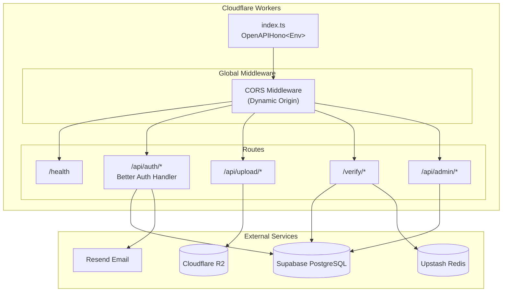
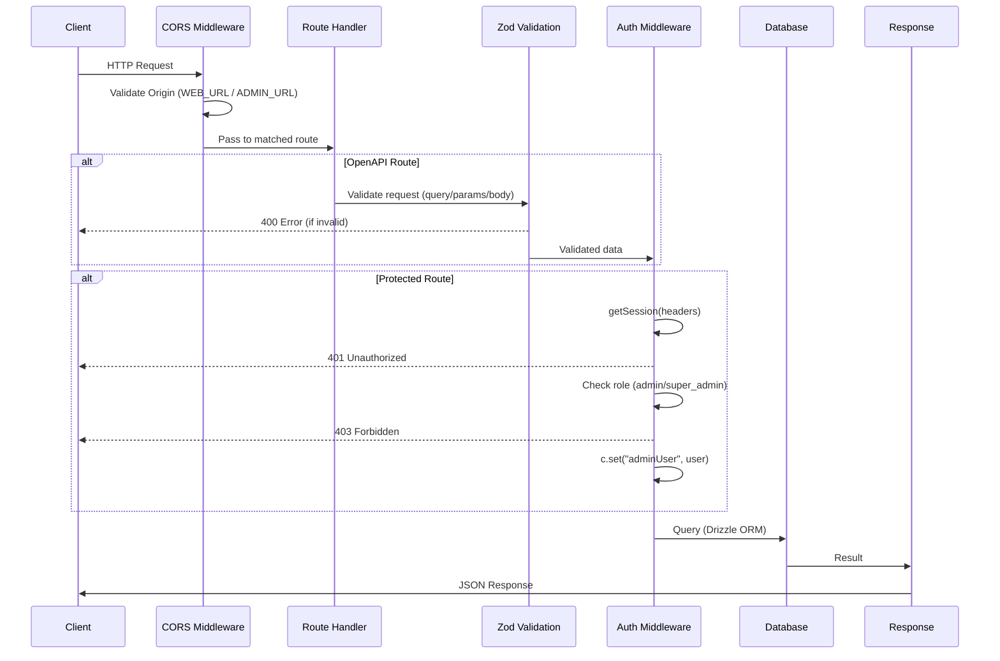
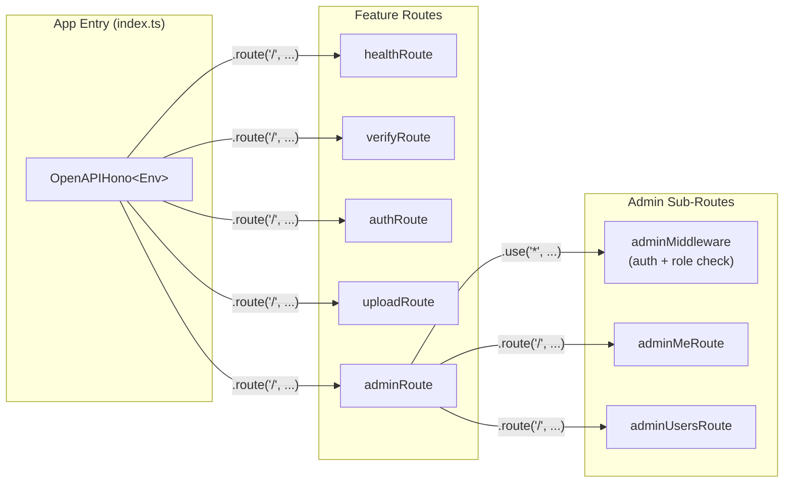
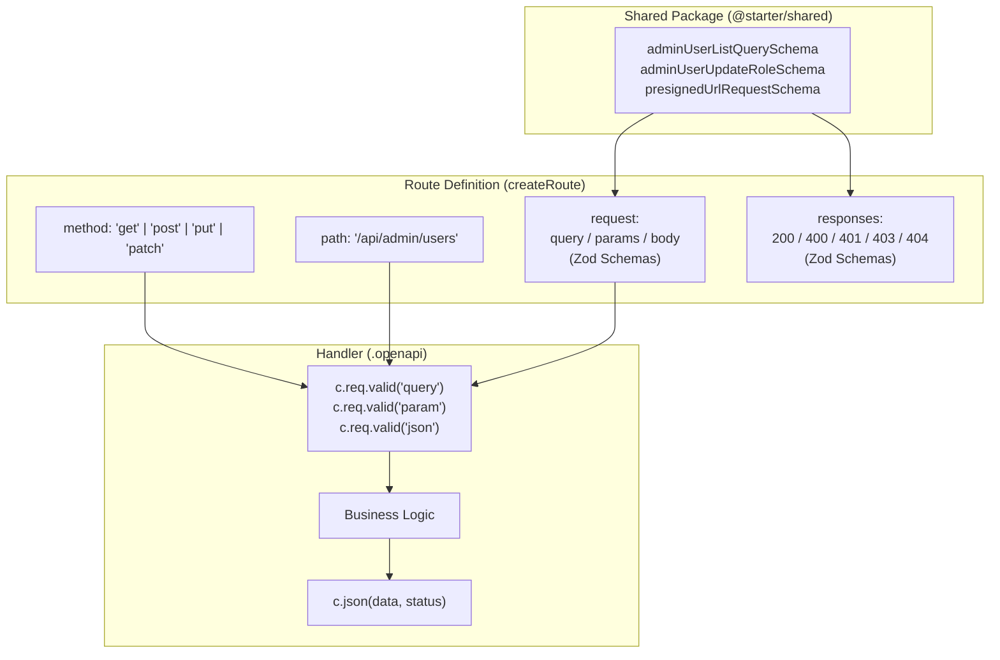
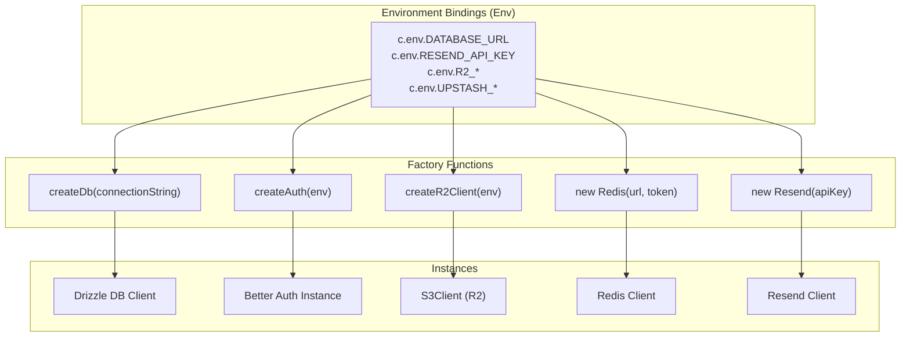
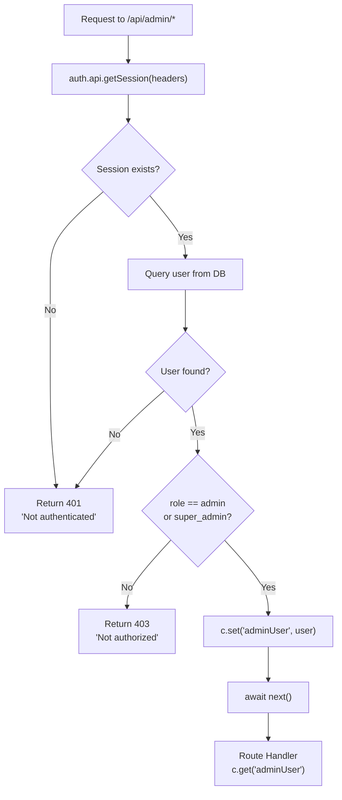
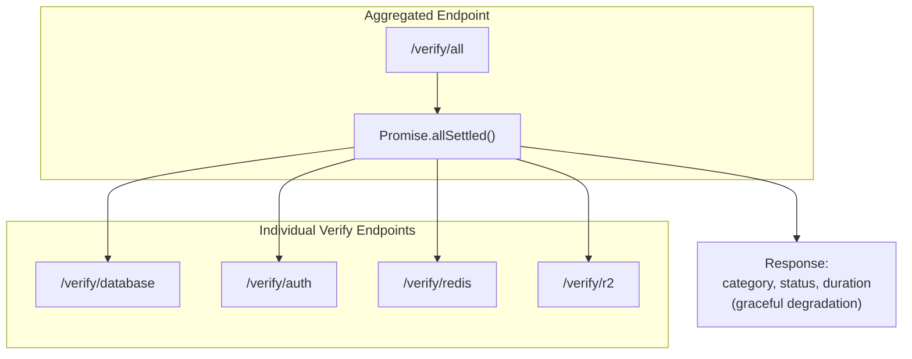
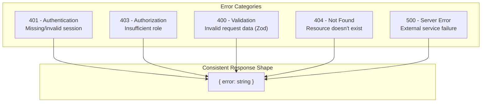

# API App (Hono.js) - Design Pattern Diagrams

## Overall Architecture

## Request Processing Flow

## Route Composition Pattern

## OpenAPI Route Definition Pattern

## Factory Pattern (Service Instantiation)

## Admin Middleware Pattern

## Verify Aggregation Pattern

## Error Handling Pattern

