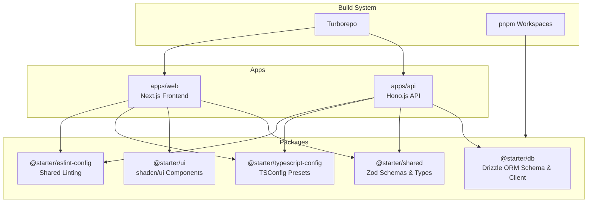
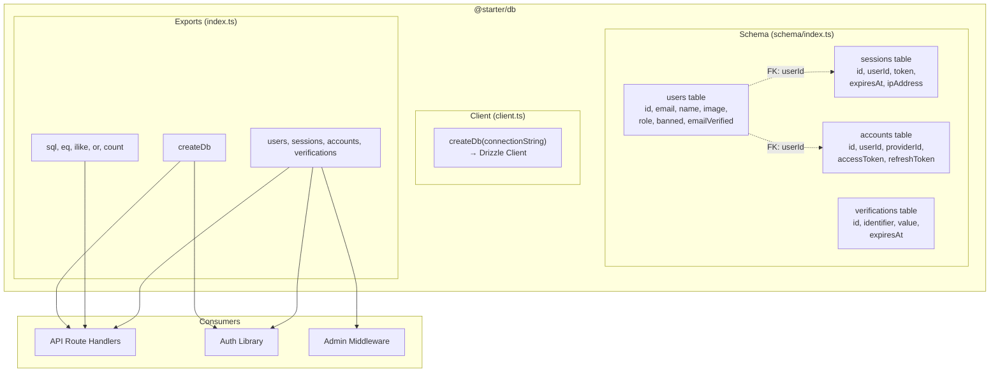
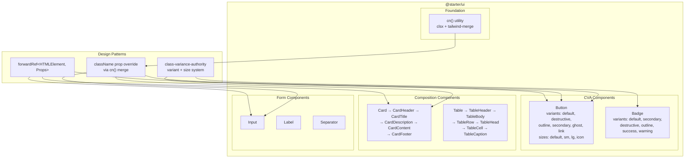
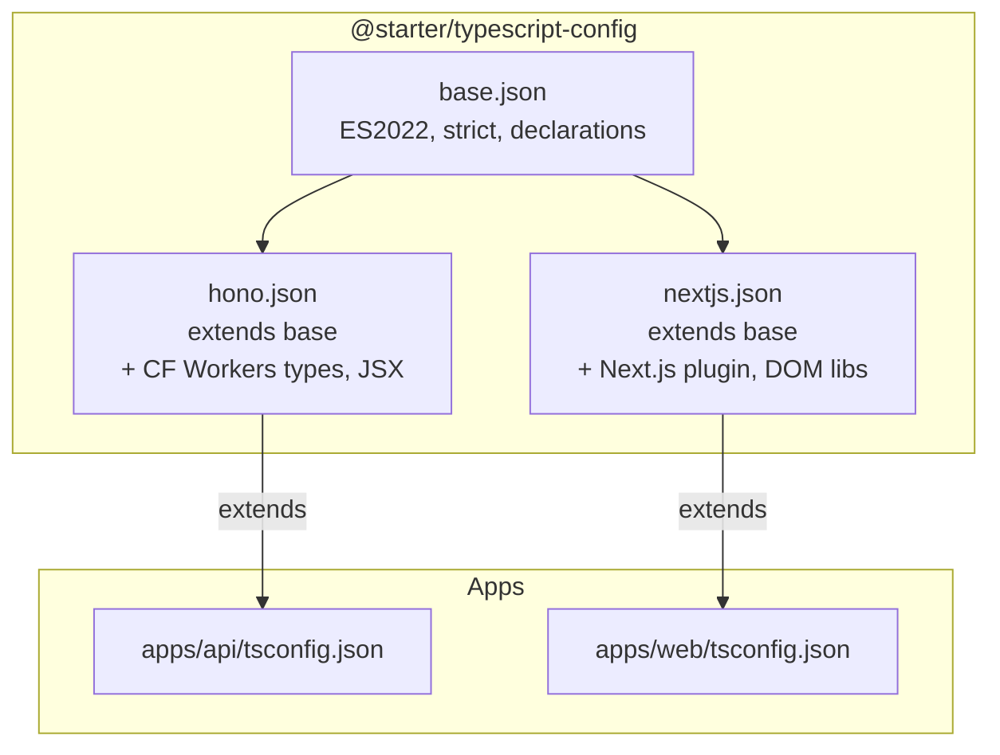
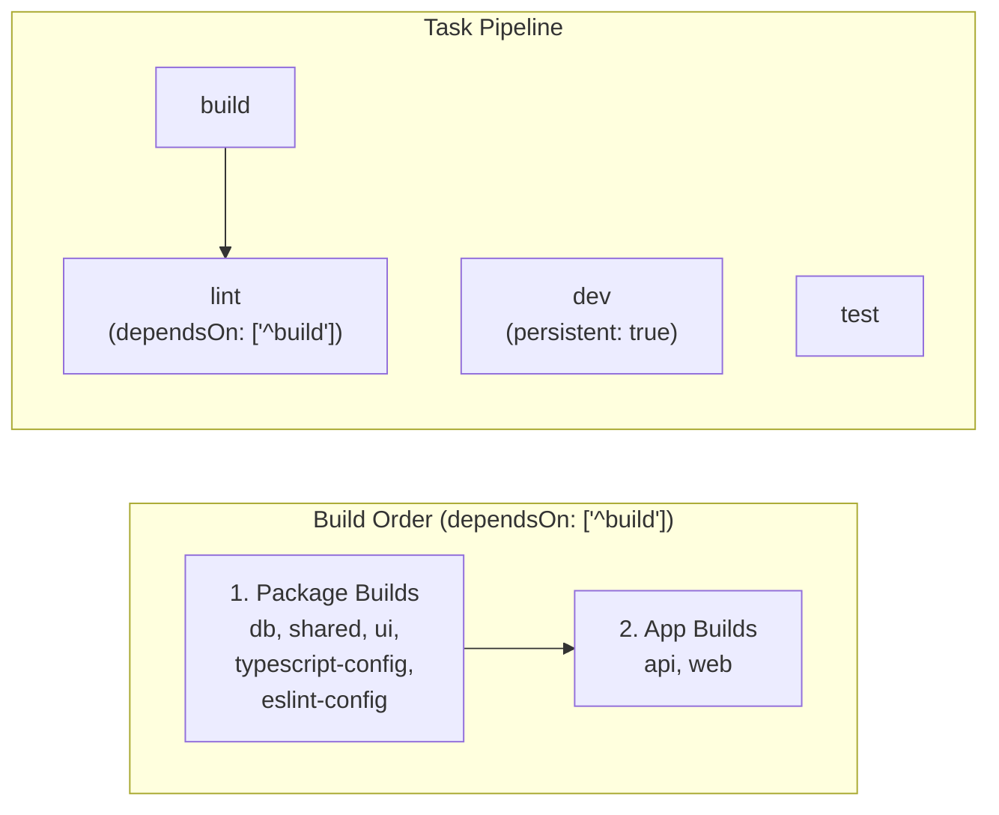
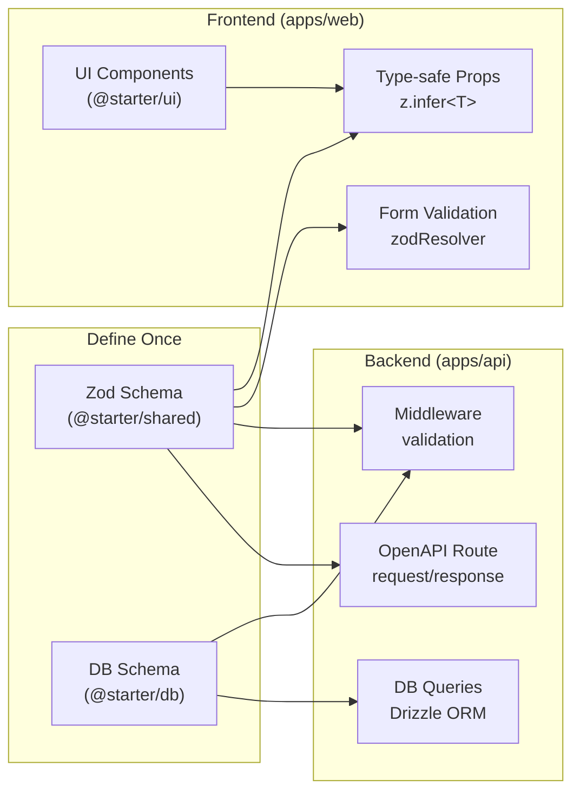

# Shared Packages - Design Pattern Diagrams

## Monorepo Architecture Overview

## @starter/db - Database Package

## @starter/shared - Schema Sharing Pattern

```mermaid
graph TB
    subgraph "@starter/shared"
        subgraph "types/auth.ts"
            PasswordSchema["passwordSchema<br/>(min 8, uppercase, number)"]
            LoginSchema["loginSchema<br/>{email, password}"]
            RegisterSchema["registerSchema<br/>{name, email, password,<br/>passwordConfirmation}<br/>+ refine(passwords match)"]
        end

        subgraph "types/admin.ts"
            RoleSchema["userRoleSchema<br/>enum: user | admin | super_admin"]
            ListQuery["adminUserListQuerySchema<br/>{page, limit, search}"]
            UpdateRole["adminUserUpdateRoleSchema"]
            UpdateStatus["adminUserUpdateStatusSchema"]
            UserResponse["adminUserSchema"]
            ListResponse["adminUserListResponseSchema"]
        end

        subgraph "types/upload.ts"
            Constants["ALLOWED_IMAGE_TYPES<br/>MAX_FILE_SIZE (5MB)"]
            PresignedReq["presignedUrlRequestSchema"]
            PresignedRes["presignedUrlResponseSchema"]
        end

        subgraph "utils/index.ts"
            FormatDate["formatDate()"]
        end
    end

    subgraph "Backend Usage"
        OpenAPI["OpenAPI Route Definition<br/>request / response schemas"]
        Validation["c.req.valid('query')<br/>c.req.valid('json')"]
    end

    subgraph "Frontend Usage"
        FormResolver["zodResolver(schema)<br/>React Hook Form"]
        TypeInfer["z.infer&lt;typeof schema&gt;<br/>TypeScript types"]
    end

    LoginSchema --> OpenAPI
    LoginSchema --> FormResolver
    RegisterSchema --> FormResolver
    ListQuery --> OpenAPI
    UserResponse --> OpenAPI
    PresignedReq --> OpenAPI
    ListQuery --> TypeInfer
    UserResponse --> TypeInfer
```

## @starter/ui - Component Library Pattern

## TypeScript Config Inheritance

## Turborepo Build Pipeline

## Data Flow Across Packages

