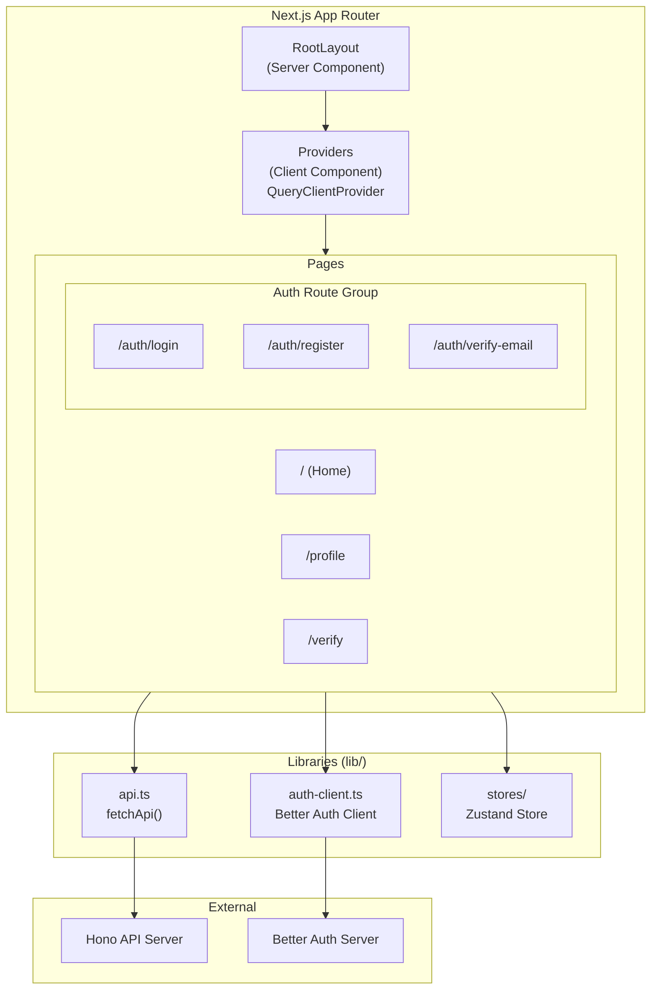
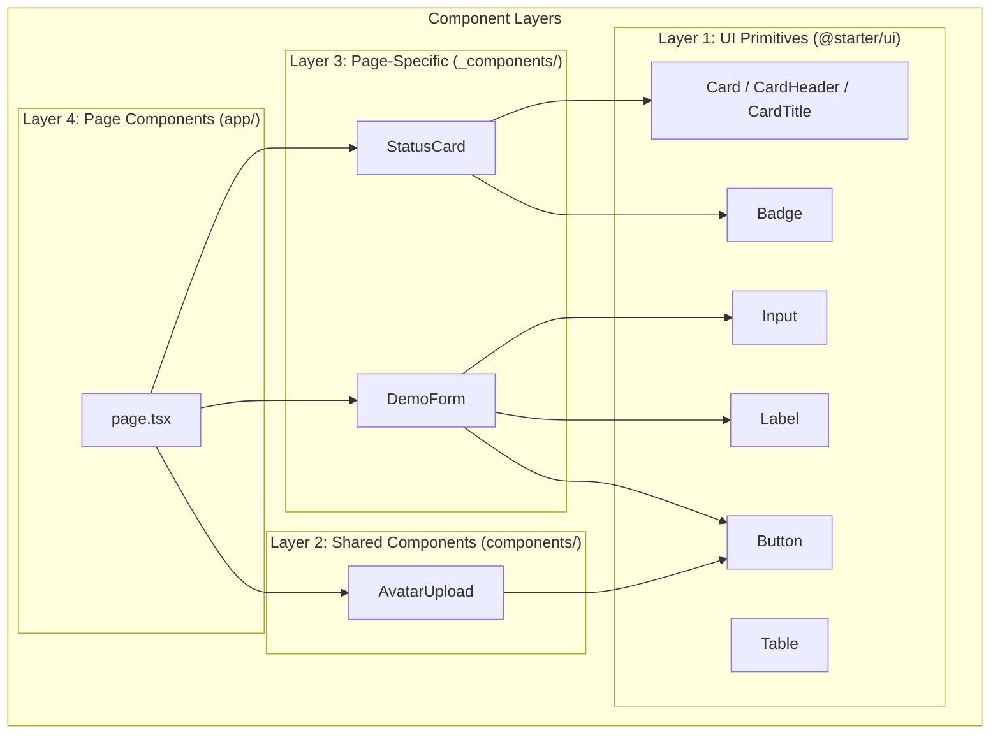
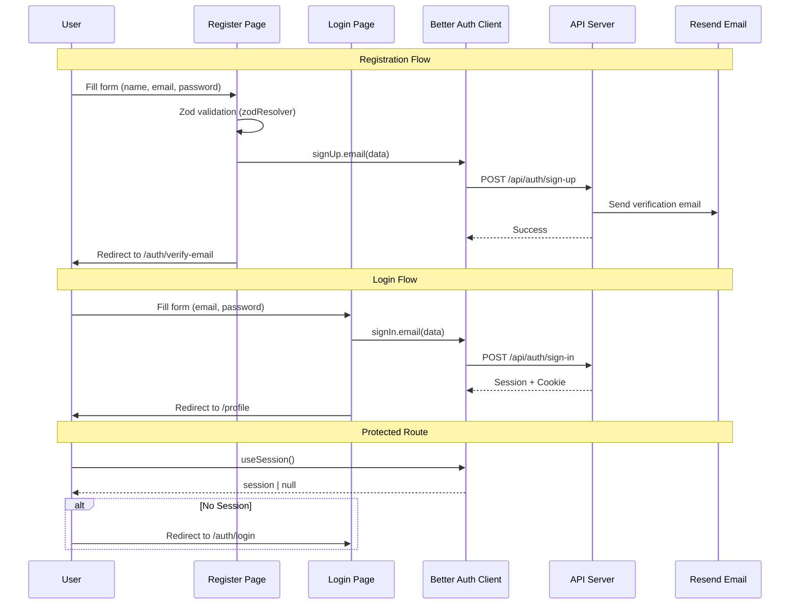
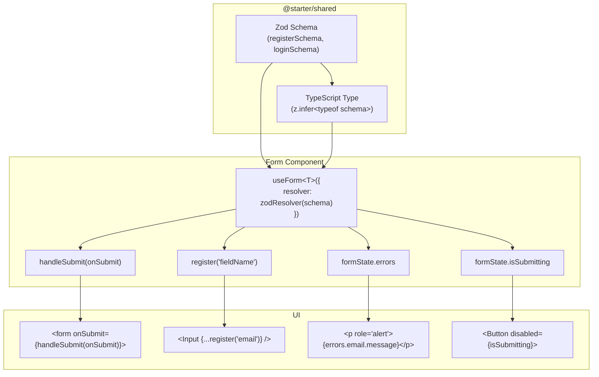
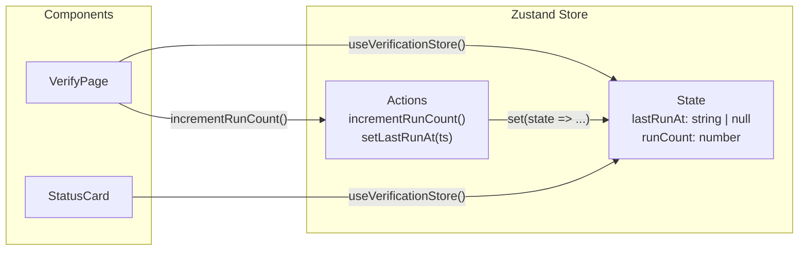
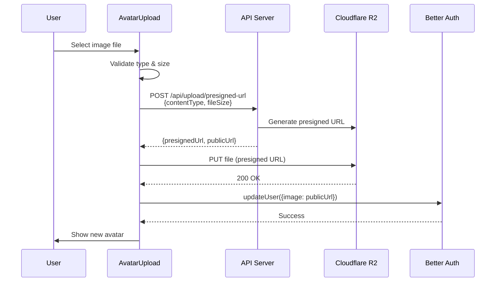
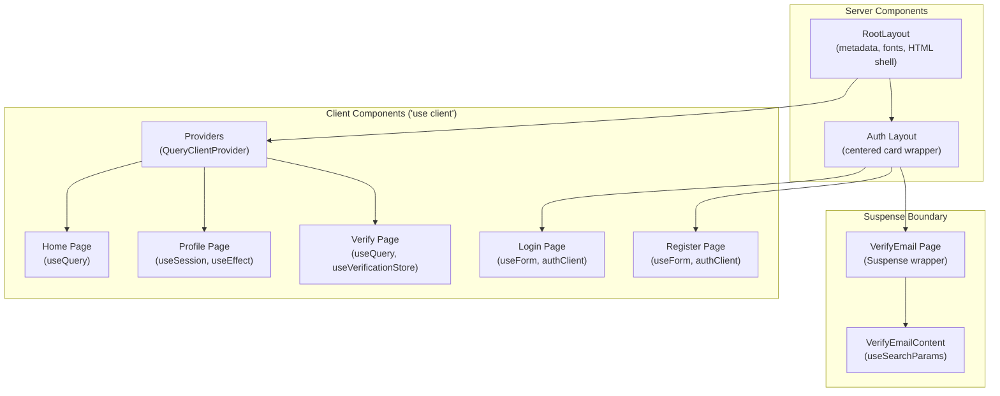
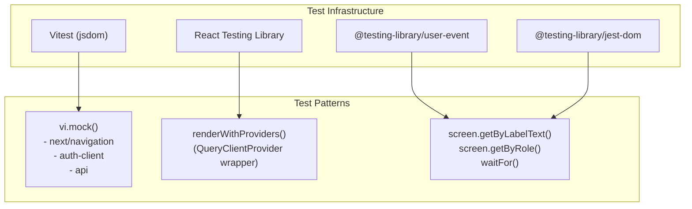

# Web App (Next.js) - Design Pattern Diagrams

## Overall Architecture



## Component Organization



## Data Fetching Pattern (TanStack Query)

```mermaid
sequenceDiagram
    participant Page as Page Component
    participant TQ as TanStack Query
    participant API as fetchApi()
    participant Server as API Server

    Page->>TQ: useQuery({ queryKey, queryFn })
    TQ->>TQ: Check cache (staleTime: 60s)

    alt Cache Hit (fresh)
        TQ-->>Page: Return cached data
    else Cache Miss / Stale
        TQ->>API: fetchApi&lt;T&gt;("/path")
        API->>Server: HTTP GET
        Server-->>API: JSON Response
        API-->>TQ: Typed data
        TQ->>TQ: Update cache
        TQ-->>Page: { data, isLoading, error }
    end

    Note over Page,TQ: Manual refetch pattern
    Page->>TQ: useQuery({ enabled: false })
    Page->>TQ: refetch() (on user action)
```

## Authentication Flow



## Form Handling Pattern (React Hook Form + Zod)



## State Management Pattern (Zustand)



## File Upload Flow



## Server vs Client Component Pattern



## Testing Pattern


